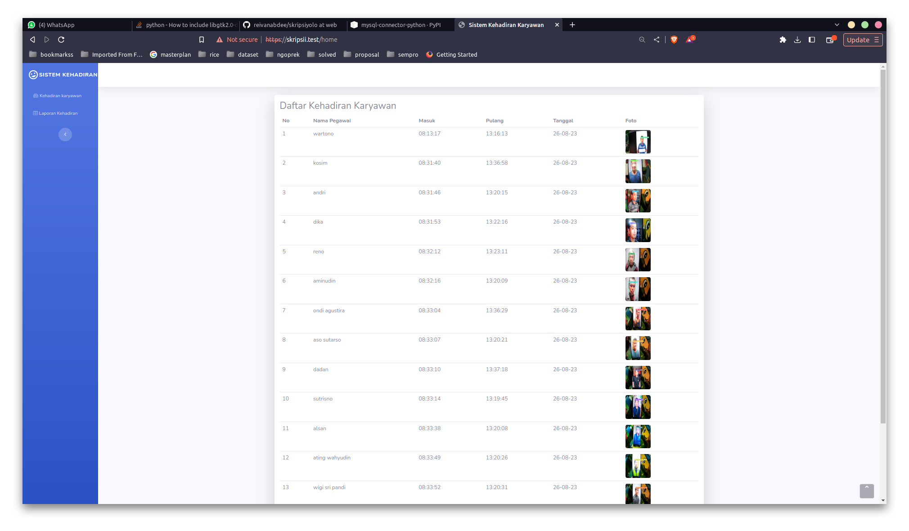
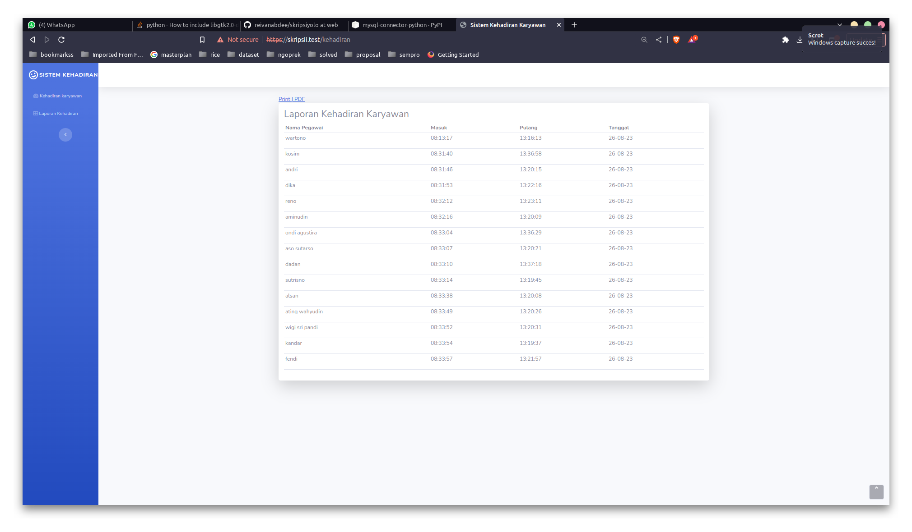

# Sistem Presensi Menggunakan YOLOv5 dengan Web Laravel
Project ini adalah backup dari skripsi saya

## Installation

requipment yang dibutuhkan

```bash
pip install -r requipments.txt
```

## Usage
download semua file yang ada di branch main, web, db.Import semau db. Konfigurasi database di .env web & absen.py 

```python
python3 absen.py --source 0 --weights your.pt
```

## output

hasil keluaran deteksi terdapat pada web


## License

[MIT](https://choosealicense.com/licenses/mit/)
